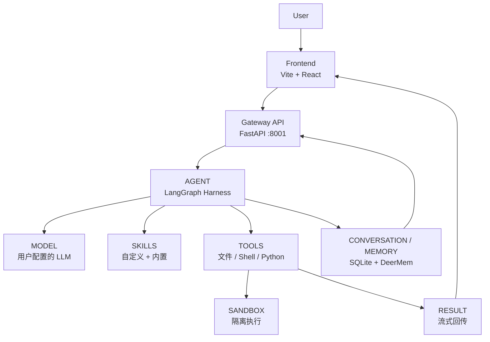

# WorkGuide - LangGraph 超级智能体框架

> 本项目基于 [ByteDance WorkGuide](https://github.com/bytedance/workguide)（MIT 协议）二次整理维护的个人构建版本。

一套基于 **LangGraph** 的**超级智能体（Agent）工作台**：通过编排 **工具调用（Tool Calling）、可扩展 Skills、长期记忆和隔离沙箱**，并配套一套**自定义 Vite + React 前端**，让你在本地运行一个功能完整、可多渠道接入的 AI 智能体系统。

## 核心能力

| 能力 | 说明 |
| --- | --- |
| **AI Agent** | 主代理 + 子代理委派；多步骤任务编排；流式输出（SSE） |
| **Tool Calling** | 内置文件读写、Shell/Python 执行等工具，按任务自动调用 |
| **Custom Skills** | 用户可创建 / 编辑 / 启用 / 禁用 / 删除自定义技能，运行时注入 Agent 上下文 |
| **Conversation** | 对话的新建 / 切换 / 重命名 / 删除，SQLite 持久化，刷新不丢失 |
| **File Processing** | 前端真实上传文件到会话 |
| **Memory** | 长期记忆抽取、上下文压缩、持久化记忆（DeerMem） |
| **Sandbox** | 基于 e2b 的隔离执行环境（也可本地沙箱） |
| **Model Management** | 多模型服务商切换；本地自定义模型增删改 |

## 技术栈

- **后端**：Python 3.12+ · FastAPI · LangGraph · uv · SQLite(Alembic)
- **前端**：Vite 6 · React 19 · TypeScript 5.7 · Tailwind CSS 4 · pnpm
- **测试**：pytest（后端）· Playwright（前端 E2E）· GitHub Actions CI
- **基建**：Docker Compose · Nginx · Helm

## Architecture



数据流：**用户输入 → 前端 → Gateway API → Agent → 模型 → Skills/Tools → 沙箱执行 → 结果流式回传 → Conversation/Memory 持久化**。

## 快速开始

完整安装说明见 [`Install.md`](./Install.md)。WorkGuide 支持两种启动方式：**本地开发**（前端 + 后端分别启动）或 **Docker 一键运行**（一次启动整套服务栈）。任意环境请先准备配置：

```bash
# 生成配置(config.yaml / extensions_config.json)
make config
# 没有 make 时（Windows）可手动复制：
#   cp config.example.yaml config.yaml
#   cp extensions_config.example.json extensions_config.json
# 本地无鉴权（仅本地；生产默认开启鉴权）
export WORKGUIDE_AUTH_DISABLED=1   # Windows: set WORKGUIDE_AUTH_DISABLED=1
```

### 方式 A：本地开发

后端 + 前端分别启动，适合高频改动与调试。

```bash
# 后端 Gateway（:8001）
cd backend && uv sync --all-groups --locked
cd backend && uv run uvicorn app.gateway.app:app --host 0.0.0.0 --port 8001

# 前端 Vite dev server（:3000，/api 自动代理到 :8001）
cd frontend && pnpm install
cd frontend && pnpm dev
```

浏览器访问 <http://localhost:3000>。`make dev` 是等价的聚合命令。前端代码改动即时热更新；后端多用 `uv run uvicorn --reload` 自动重载。

> 后端模型密钥放在 `backend/.env`，`config.yaml` 中的 `provider` 配置指向它。

### 方式 B：Docker 一键运行

需要 [Docker Desktop](https://www.docker.com/products/docker-desktop/)。Docker 模式默认会启动 **Frontend（Vite SPA） + Backend（Gateway） + Redis + Nginx** 四个服务（入口统一走 Nginx）。Sandbox Provisioner（Kubernetes 沙箱管理）是可选的，只有在需要 Kubernetes / provisioner 沙箱模式时才通过 profile 额外启用（见下方「启用 provisioner」）。

```bash
# 1. 配置环境：复制 .env.example -> .env 并填写所选模型服务商的 API Key
cp .env.example .env
#    例如使用智谱：在 .env 中设置 ZHIPU_API_KEY=...
#    注意：WorkGuide 不内置、也不默认绑定某个具体模型，需要你自行在
#    config.yaml 中配置可用的 LLM 模型及对应 API Key（由模型项通过 $VAR 引用
#    .env 中的密钥）；如使用涉及向量检索/嵌入的功能，还需按需配置 Embedding 模型。

# 2. 生成配置（见上文；Windows 无 make 时手动复制即可）

# 3. 一键构建并启动（Linux/macOS 与 Windows PowerShell 同一条命令，无需 git bash / make）
docker compose -f docker/docker-compose.yaml up --build
```

启动后浏览器访问 **<http://localhost:2026>**（Nginx 对外端口；默认仅绑定 127.0.0.1）。

> docker compose 的宿主机路径（config.yaml / WORKGUIDE_HOME / Skills 等）已在 compose 内给出仓库相对默认值，因此无需手工配置这些路径。`make up` 是等价的聚合命令，并会额外为你探测路径、生成默认 secret。

#### 启用 provisioner（Kubernetes 沙箱模式）

普通 `docker compose up --build` **不会启动 provisioner**。仅在你确实需要 Kubernetes / provisioner 沙箱模式（`docker/provisioner/`）时，通过 profile 显式启用：

```bash
docker compose -f docker/docker-compose.yaml --profile provisioner up --build
```

> 该模式需要宿主机上运行中的 Kubernetes 集群（如 Docker Desktop / OrbStack / minikube / kind），并把 `config.yaml` 的沙箱配置为 provisioner 模式。`make up` 已按 `config.yaml` 的 `sandbox` 配置自动决定是否拉起 provisioner。

### 方式 C：CLI 终端工作台

不依赖浏览器，直接在终端里与 Agent 交互。CLI 入口是 `workguide` 控制台脚本（由 `workguide-harness` 提供），支持交互式 TUI 与无头一次性模式。

```bash
# 1. 安装后端依赖（含 TUI）
cd backend && uv sync --all-groups --locked

# 2. 交互式 TUI（全屏终端界面）
uv run workguide

# 3. 无头一次性问答（打印最终答案后退出）
uv run workguide --print "创建一个文本文件并写入 Hello World"

# 4. 无头流式（输出 newline-delimited JSON StreamEvents，适合脚本/管道）
uv run workguide --json "你好"

# 5. 继续最近的会话 / 按 id 或标题恢复指定会话
uv run workguide --continue
uv run workguide --resume "我的会话标题"
```

> 在 Windows 上，仓库根目录的 `workguide.cmd`（或 `workguide`）是另一条一键启动命令：它会同时拉起后端（:8001）与前端（:3000）并打开浏览器，等价于 `make dev`。`workguide --stop` 可停止它启动的服务。更多 CLI 参数见 `uv run workguide --help`。

## 环境变量

按用途区分，避免混淆：

| 文件 | 作用 | 本地开发 | Docker |
| --- | --- | --- | --- |
| `.env` | 运行时密钥（模型/搜索/IM API Key、`WORKGUIDE_AUTH_DISABLED` 等） | 可选 | **必填**，Gateway 容器通过 `env_file: ../.env` 读取 |
| `backend/.env` | 后端本地运行的模型密钥（`ZHIPU_API_KEY` 等） | 必填 | 无需（用根 `.env`） |
| `config.yaml` | 主配置：模型 provider、数据库（SQLite）、skill 开关 | 必填 | 必填（compose 只读挂载） |
| `extensions_config.json` | MCP / Skills 启停配置 | 必填 | 必填（compose 可写挂载） |
| `frontend/.env` | 前端 Vite 变量（`VITE_*`）。当前前端无任何 `VITE_*` 变量，**无需配置** | 无需 | 无需 |

- `.env.example` 为占位模板（只含变量名，无真实密钥），复制为 `.env` 后填入 API Key。
- 你在 `config.yaml` 中配置的 LLM 等模型的 API Key 放在 `backend/.env`（本地开发）或根 `.env`（Docker），由对应模型项的 `api_key: $VAR` 引用。
- `.env` / `config.yaml` / `extensions_config.json` 均已 gitignore，**不会进入仓库**。`frontend/.env` 同理（且前端变量会打进浏览器 bundle，禁止放入任何 Secret）。
- 常见变量：`ZHIPU_API_KEY`（或各模型服务商 Key）、`WORKGUIDE_AUTH_DISABLED=1`（本地跳过鉴权）、`E2B_API_KEY`（云沙箱，可选）。

## 测试分层

测试按依赖强度分层，职责清晰：

| 层级 | 内容 | 运行位置 |
| --- | --- | --- |
| **Unit** | 核心逻辑：Skill/Thread/Storage/路由 | 任意环境（`pytest`） |
| **Integration** | 网关路由、持久化、Skill 生命周期 | 任意环境（需本地 SQLite） |
| **E2E** | 前端真实浏览器交互（Playwright） | 本地，需前端 :3000 + 后端 :8001 |
| **Environment-dependent** | symlink/权限/POSIX 路径/TUI 等 | Linux CI 通过；Windows 需开发模式 |
| **External-service** | 需要 API Key；外部 IM/Redis/真实模型 | 显式 opt-in，不在默认门禁内 |

### 命令

```bash
# 后端核心测试
cd backend && uv sync --all-groups --locked
cd backend && uv run pytest tests/test_skills_custom_router.py tests/test_user_scoped_skill_storage.py \
              tests/test_local_skill_storage_write.py tests/test_threads_router.py -q

# 前端类型检查 + 生产构建
cd frontend && pnpm install
cd frontend && pnpm exec tsc --noEmit && pnpm build

# 前端 E2E（需已启动后端 :8001）
cd frontend && npx playwright test
```

### 测试目标

- **Windows 本地开发**：聚焦 Unit / Integration / 前端构建 / E2E。
- **Linux CI**（`.github/workflows/ci.yml`）：跑 Unit / Integration（含 symlink 用例）+ 前端 typecheck/build，作为发布门槛。

真实模型与需要 API Key 的测试**不在默认门槛**内，本地已验证。

## CI

`.github/workflows/ci.yml` 在 Push / PR 时自动运行：

- **backend-core**：`uv sync --all-groups --locked` + 核心 pytest（Skill/Thread/Storage）
- **frontend-build**：`pnpm install --frozen-lockfile` + `tsc --noEmit` + `vite build`

> 完整后端全量测试（含外部服务/平台相关用例）在一台未开启 symlink 权限的 **Windows 本地**会出现平台相关失败——这部分属 `ENVIRONMENT BLOCKED`，不是产品缺陷；在 Linux CI 上可正常通过。

## 项目结构

```
WorkGuide/
├── backend/            # FastAPI Gateway + LangGraph 智能体运行时 + IM 渠道
│   ├── app/gateway/    # REST 路由（threads / skills / models / memory…）
│   ├── packages/       # harness（Agent 框架）与 extension-api（扩展契约）
│   ├── tests/          # pytest 测试
│   └── agent_e2e_check.py  # Agent 端到端验证脚本
├── frontend/           # Vite + React 聊天界面
│   ├── src/            # 组件 / lib（api·useChat·sse）/ 状态
│   └── e2e/            # Playwright E2E 测试
├── skills/             # 可扩展 Skills 仓库（public 提交 / custom gitignore）
├── .github/workflows/  # GitHub Actions CI
├── docs/               # 设计文档与说明
├── scripts/            # 编排脚本
└── Makefile            # 顶层编排
```

## License

[MIT](./LICENSE)。

本项目基于字节跳动开源的 [WorkGuide](https://github.com/bytedance/workguide) 维护，原代码版权归其贡献者所有，并遵循原始 MIT 许可条款。